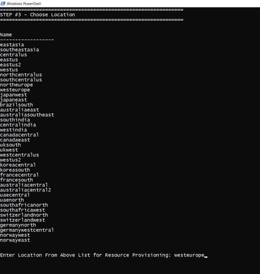
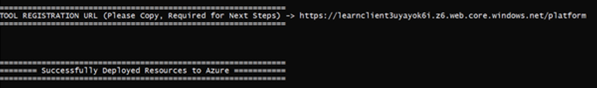

# Deployment Guide

## Prerequisites

To begin, you will need:

* [Azure CLI](https://docs.microsoft.com/en-us/cli/azure/install-azure-cli?view=azure-cli-latest?WT.mc_id=ltiAssessment-github-cxa)
* [.NET Core SDK](https://dotnet.microsoft.com/download?WT.mc_id=lti-github-cxa)
* [Node.js](https://nodejs.org/en/download/)
* [PowerShell](https://docs.microsoft.com/en-gb/powershell/scripting/install/installing-powershell?view=powershell-7.1&viewFallbackFrom=powershell-7%3FWT.mc_id%3DltiAssessment-github-cxa)
* [Git](https://git-scm.com/downloads)
* [Azure Subscription](https://azure.microsoft.com/free?WT.mc_id=ltiAssessment-github-cxa)
* [Visual Studio Code](https://code.visualstudio.com?WT.mc_id=ltiAssessment-github-cxa)
* [NuGet](https://www.nuget.org/downloads)

Follow the steps to deploy the Microsoft Assessment App.

## Step 1: Clone the GitHub repository.

1. Go to the [repository](https://github.com/microsoft/AzureLTIAssessmentApp) and click the “Code” button and select clone.
2. Open a command prompt and go to the directory where you would like to install the Assessment App source code.
3. Enter "git clone" and the URL you copied before. For example, “git clone https://github.com/microsoft/AzureLTIAssessmentApp.git”

## Step 2: Deploy to Azure Subscription using Deployment script.

* In the cloned repository, inside the deployment directory, execute the **Deploy.ps1** file.
* You should now see the script popup.

### Login to Azure

The script will ask you to login to Azure by navigating to the Azure Login Page on your browser.

### Choose Subscription

Type in the name of the Azure subscription that you hold (this is a prerequisite necessary for deployment).

If you're unsure about whether your account has a subscription, check [here](https://ms.portal.azure.com/#blade/Microsoft_Azure_Billing/SubscriptionsBlade??WT.mc_id=ltiassessment-github-cxa).

### Choose Location

The following regions are supported:

* eastasia
* southeastasia
* centralus
* eastus
* eastus2
* westus
* southcentralus
* northeurope
* westeurope
* japaneast
* brazilsouth
* australiaeast
* canadacentral
* uksouth
* westcentralus
* westus2
* koreacentral

Locate your region from the list above. Then type it into the script and hit "Enter".

Your region determines three things:

* Compliance and Data Residency
* Service Availability
* Pricing

For information regarding your region, check [here](https://azure.microsoft.com/global-infrastructure/geographies/?WT.mc_id=ltiAsssessment-github-cxa).

### Tool Registration URL

The Script will display the Tool Registration URL after completion. **Please copy the URL and keep it handy** since it will be required while configuring the tool in the LMS.

Open the tool registration page from your browser and take note of the following parameters.

* Login URL
* Launch URL
* Domain URL
* Public Key
* Public JWK
* Public JWK Set URL

**Congratulations!** Your instance of the tool should now be deployed on Azure!

Once the tool has been successfully deployed, the next step is to [configure](CONFIGURATION_GUIDE.md) the tool on your institution's LMS.
