# Educator Guide

This guide is designed for educators who use [Moodle LMS](https://moodle.org/).

## Table of content
1. [How to create an assessment on Moodle using the Assessment App](#create-assessment)
2. [How to set up an assessment in the Assessment App](#assessment-setup)
3. [How to create a new question bank](#create-question-bank)
4. [How to create a new question](#create-question)
5. [How to import and export question banks](#import-export-question-banks)
6. [How to browse Assessment Analytics](#assessment-analytics)

## How to create an assessment on Moodle using the Assessment App <a name="create-assessment"/>

To begin, you need to login to Moodle LMS and follow the steps:

1. Go to the course page where you would like to create an assessment.

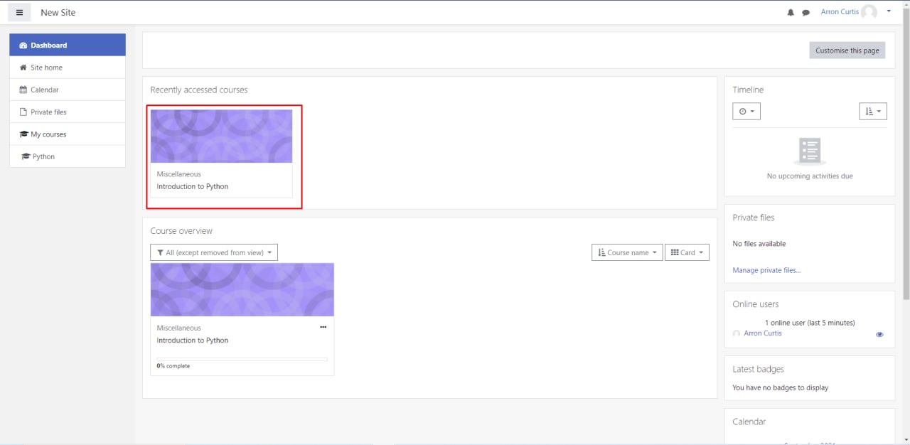

2. Turn editing on to create the assessment.

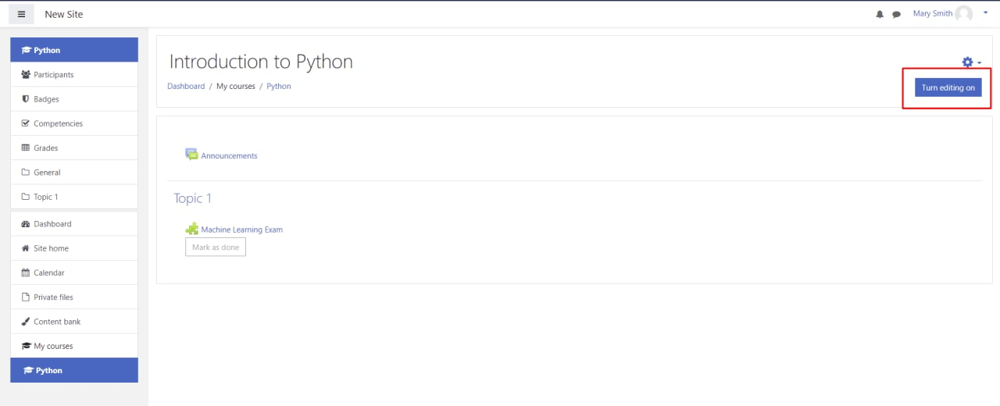

3. Choose **Add an activity or resource**.


4. Click **External tool**.

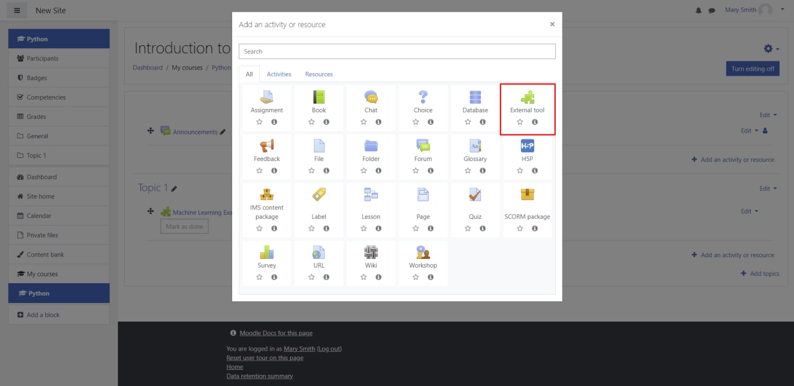

5. Type a preferred **Activity Name** and choose the Assessment App as a **Preconfigured Tool**. Click **Save and return to the course**.

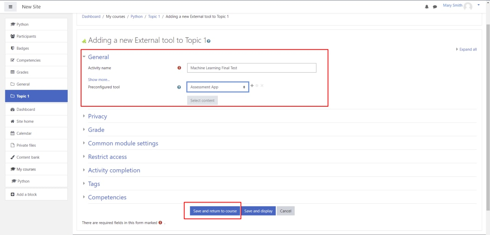

6. Click **Turn editing off**.

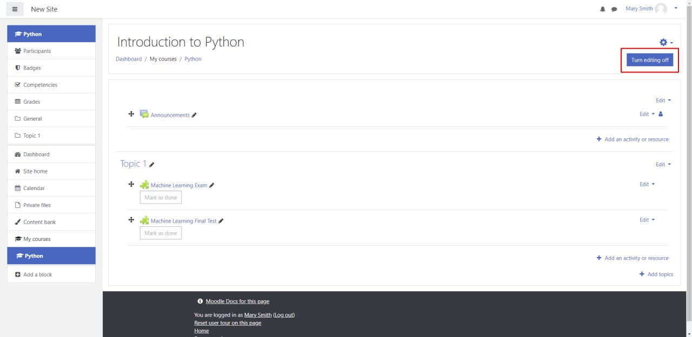

7. Click on the created assessment.

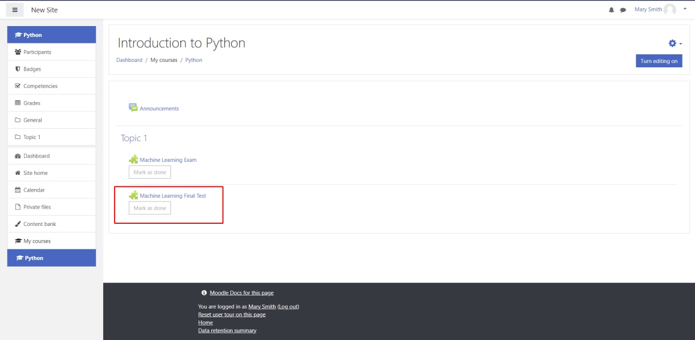

The assessment was created. You will be redirected to the Assessment App, where you can configure the created assessment: choose the deadline, assessment duration, questions and participants.

## How to set up an assessment in the Assessment App <a name="assessment-setup"/>

1. You are on the assessment setup page. Here you can add the assessment description, select the deadline and the assessment duration.

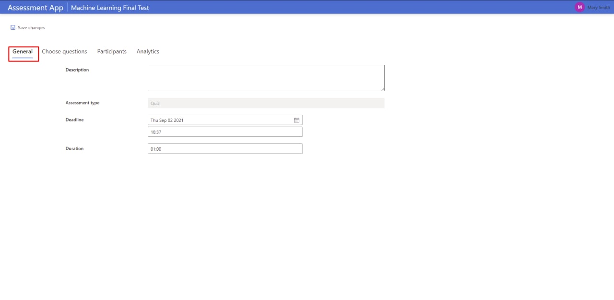

When you are ready, click **Choose questions**.

2. Choose questions from your question banks. You can select the whole question bank or some of the questions from it.

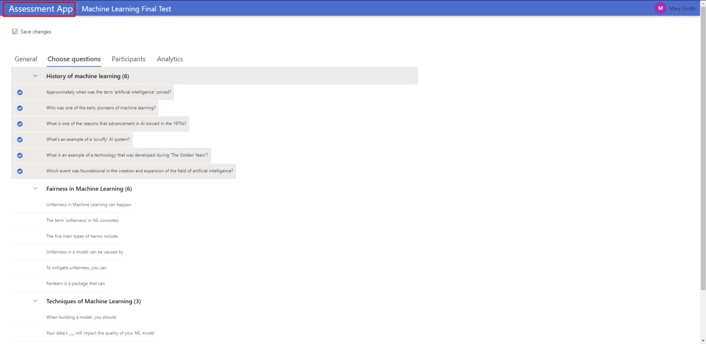

If you do not have any question banks yet, follow the links to [create the first question bank](#create-question-bank) and [add questions](#create-question) in it.

3. Choose **Participants**. Here you can see the list of participants, which was loaded from the Moodle course.

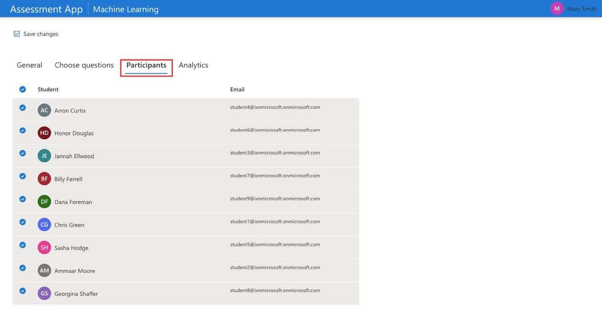

4. Click **Save changes**. Now the assessment is available for students. They can access it via the course page on Moodle.

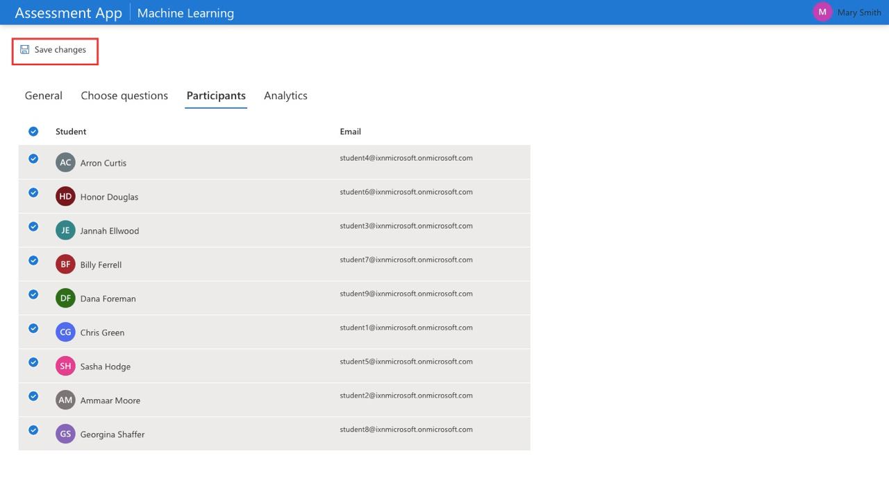

## How to create a new question bank <a name="create-question-bank"/>

1. Click on **Assessment App** on the top of the page.


2. Choose **New Question Bank**.

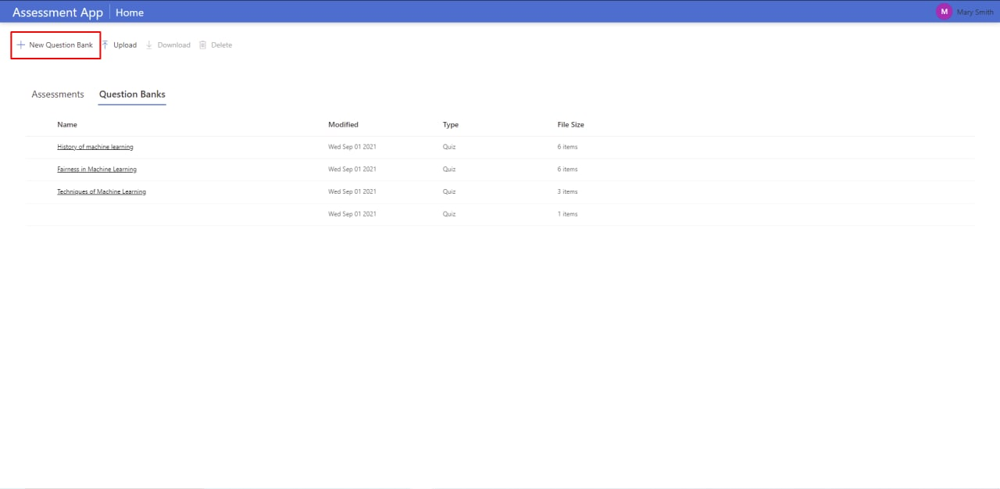

3. Now you can add the question bank's name and optional description. Click **Create** when you are ready.

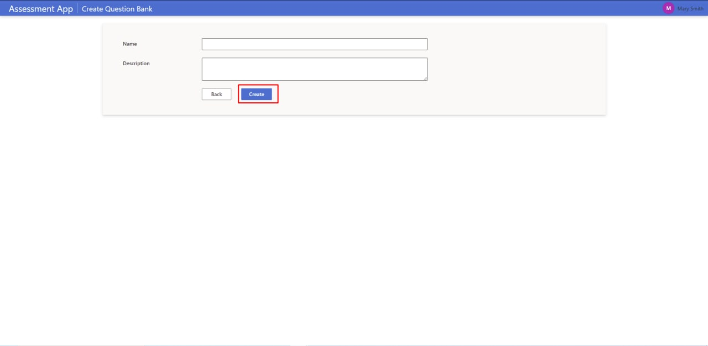

Great job! Now you have an empty question bank. You can [add questions](#create-question) in it.

## How to create a new question <a name="create-question"/>

1. Select the question bank where you would like to add a new question. Click **New Question**.

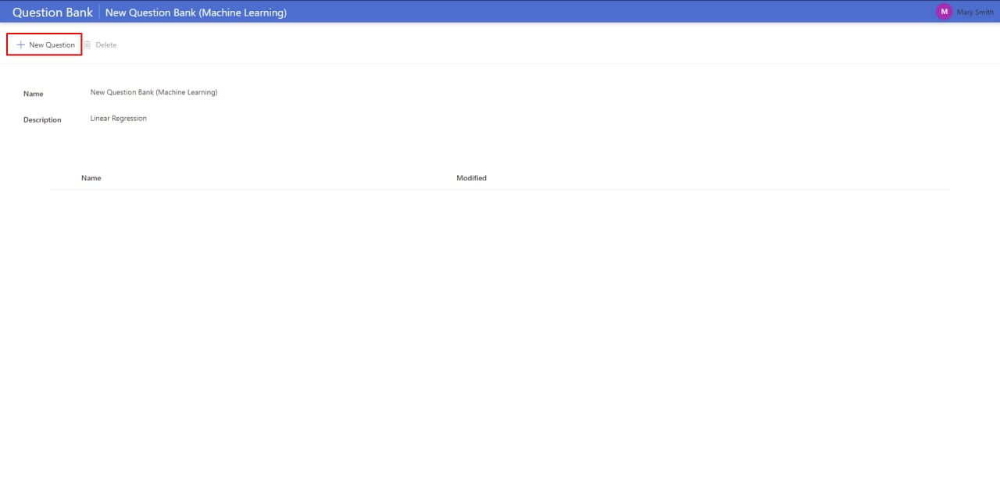

2. You are on the page where you can add information about the question: **Name, Description, Options and select the right answer**. Fill the information and click **Create** when you are ready.

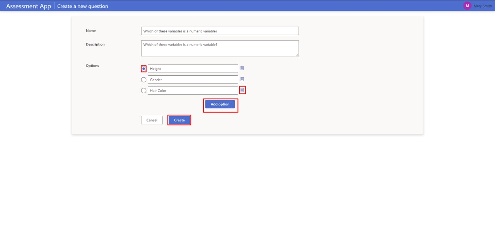

3. You should see the question you created. Add more questions if needed.

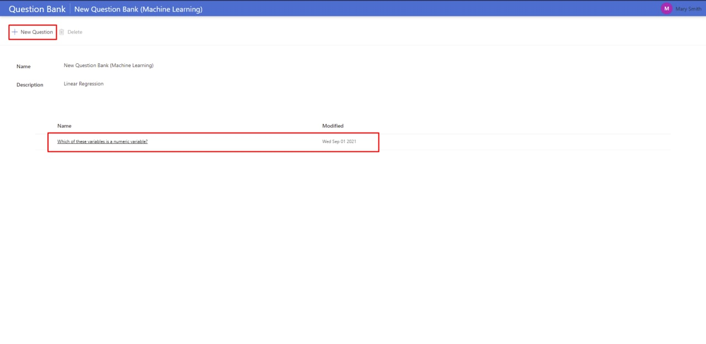

## How to import and export question banks <a name="import-export-question-banks"/>

Using the Assessment App, you can easily download and upload question banks. 

**How to download a question bank:**

1. Select a question bank which you would like to export, and click **Download** on the top of the page.

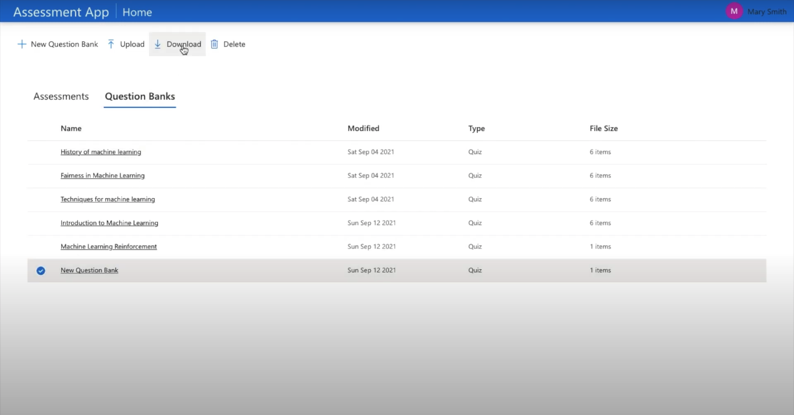

2. Choose the location on your computer where you would like to save it.
3. The selected question bank will be downloaded on your computer in JSON format.

Here is an example of how the downloaded question bank might look like:

```
[{
    "name":"Introduction to Machine Learning",
    "description":"Machine Learning for Beginners (Microsoft)",
    "questions":[
        {"name":"Applications of machine learning",
        "description":"Applications of machine learning are all around us",
        "options":["True","False"],"answer":0},
        {"name":"Machine learning algorithms",
        "description":"Machine learning algorithms are meant to simulate",
        "options":["intelligent machines","the human brain","orangutans"],
        "answer":1},
        {"name":"Example of a classical ML technique?",
        "description":"What is an example of a classical ML technique?",
        "options":["natural language processing","deep learning","neural networks"],
        "answer":0},
    "assessmentType":"Quiz"
}]
```

**How to upload a question bank:**

Click **Upload** on the top of the Home page. You will see a dialog window where you can choose the question bank from your computer (the file should be in JSON format), and click **Upload**.

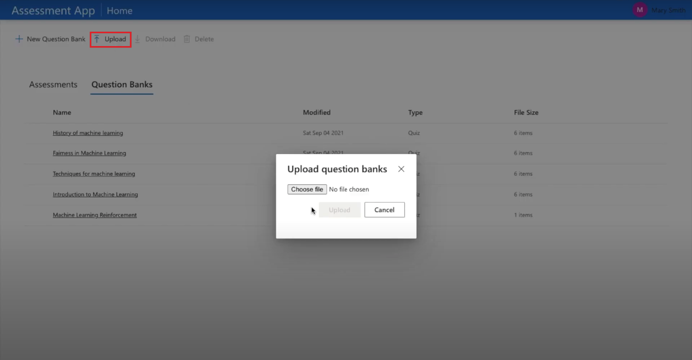

The question bank will appear in the list of question banks. 
Please, note that currently, the Assessment App supports question banks only in JSON format. 

## How to browse the Assessment Analytics <a name="assessment-analytics"/>

When you published an assessment and students completed it, you can browse the Assessment Analytics. 

To access the Assessment Analytics, select the assessment which you would like to see insights for and click **Analytics**.
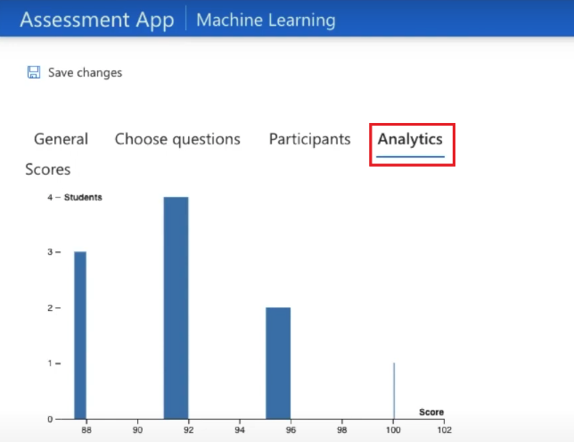

You can see two charts:

1. **Histogram** - the chart shows the distribution of student results based on their score.

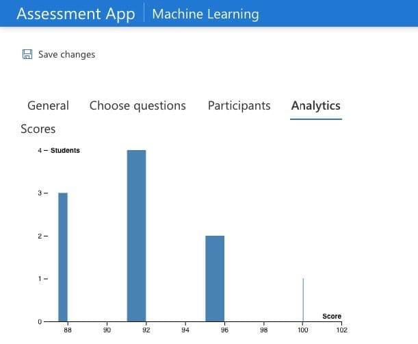

2. **Stacked  Bar  Chart** - the chart shows the proportion of correct and incorrect answers of each question.

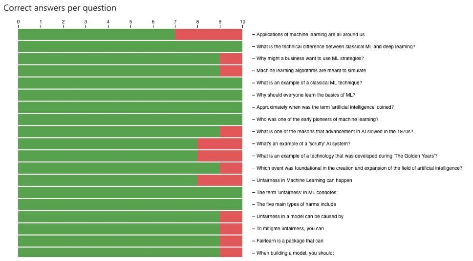
