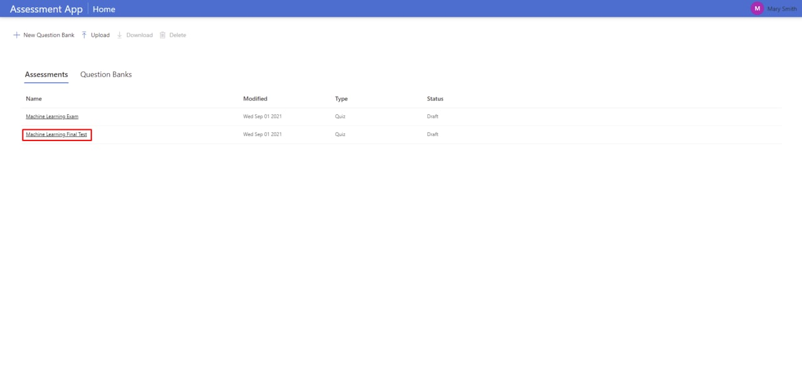

## Educator Guide

### This guide is designed for educators who use [Moodle LMS](https://moodle.org/).

To begin, you need to login to Moodle LMS and follow the steps:

1. Go to the course page where you would like to create an assessment.

2. Turn editing on to create the assessment.

3. Choose **Add an activity or resource**.

4. Click **External tool**.

5. Type a preferred **Activity Name** and choose the Assessment App as a **Preconfigured Tool**. Click **Save and return to the course**.

6. Click **Turn editing off**.

7. Click on the created assessment.

8. Now you can type an optional Description, select the deadline and the assessment duration.

At this stage, you can choose questions from question banks.

### If you are using the Assessment App for the first time:

* Click on **Assessment App**.

* Choose **New Question Bank**.

* Now you can add a name of the new question bank and add optional description. Click **Create** when you are ready.

Great job! Now you have an empty question bank. To add questions, follow steps:

* Click **New Question**.

* Now you are on the page where you can add information about the question: **Name, Description, Options and select the right answer**. Fill the information and click **Create** when you are ready.

You should see the question you created. Add more questions if needed.

Now, when you have prepared questions, you can proceed with the assessment set up.

* Go to the main page and select the assessment.

* Choose questions from the question banks.

* Choose **Participants**.

* Click **Save changes**.

### If you already have questions:

* Choose questions from the question banks.

* Choose Participants.

* Click **Save changes**.

