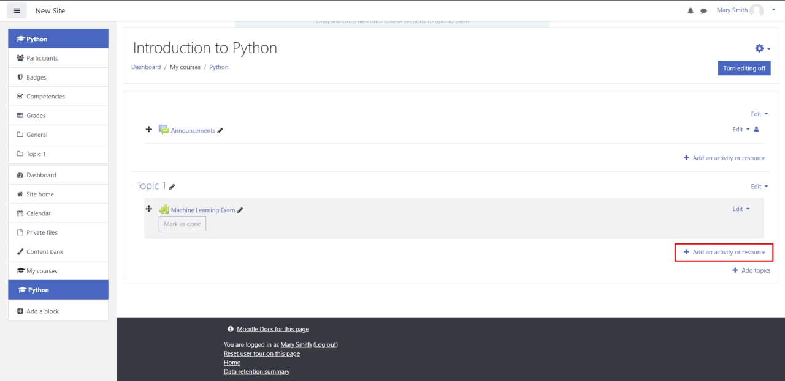

# Educator Guide

This guide is designed for educators who use [Moodle LMS](https://moodle.org/) and [Canvas LMS](https://learn.canvas.net/login/canvas).

## Table of content
1. [How to create an assessment on Moodle using the Assessment App](#create-assessment)
2. [How to create an assessment on Canvas using the Assessment App](#create-assessment-canvas)
3. [How to set up an assessment in the Assessment App](#assessment-setup)
4. [How to create a new question bank](#create-question-bank)
5. [How to create a new question](#create-question)
6. [How to import and export question banks](#import-export-question-banks)
7. [How to browse Assessment Analytics](#assessment-analytics)

## How to create an assessment on Canvas using the Assessment App <a name="create-assessment-canvas"/>

To begin, you need to login to Canvas LMS and follow the steps:

1. Pick the course where you would like to create an assessment.


2. Verify that the Assessment Application has been added as an external tool within this course by going to settings. If it hasn't, request the LMS admin to follow the [configuration guide](../docs/CONFIGURATION_GUIDE.md)


3. Go to the Assignments section of the course and click **+ Assignment**.


4. Enter title to the assignment.


5. Change **Points** to 100. Change **Display Grade as** to Percentage. Verify **Assignment Group** is set to Assignments


6. Change the submission type to **External Tool**. Click on **Find**. Select the assessment application from the list of external tools. Tick the **Load This Tool In A New Tab** checkbox. Click on **Save**.


7. Click **Save and Publish**.


The assessment should be created. You will be redirected to the assessment page, where you have to click on "Load Assessment In A New Window".  This will direct you to the Assessment App, where you can configure the created assessment: choose the deadline, assessment duration, questions and participants.

## How to create an assessment on Moodle using the Assessment App <a name="create-assessment"/>

To begin, you need to login to Moodle LMS and follow the steps:

1. Go to the course page where you would like to create an assessment.


2. Turn editing on to create the assessment.


3. Choose **Add an activity or resource**.



4. Click **External tool**.


5. Type a preferred **Activity Name** and choose the Assessment App as a **Preconfigured Tool**. Click **Save and return to the course**.


6. Click **Turn editing off**.


7. Click on the created assessment.


The assessment was created. You will be redirected to the Assessment App, where you can configure the created assessment: choose the deadline, assessment duration, questions and participants.

## How to set up an assessment in the Assessment App <a name="assessment-setup"/>

1. You are on the assessment setup page. Here you can add the assessment description, select the deadline and the assessment duration.


When you are ready, click **Choose questions**.

2. Choose questions from your question banks. You can select the whole question bank or some of the questions from it.


If you do not have any question banks yet, follow the links to [create the first question bank](#create-question-bank) and [add questions](#create-question) in it.

3. Choose **Participants**. Here you can see the list of participants, which was loaded from the Moodle course.


4. Click **Save changes**. Now the assessment is available for students. They can access it via the course page on Moodle.


## How to create a new question bank <a name="create-question-bank"/>

1. Click on **Assessment App** on the top of the page.


2. Choose **New Question Bank**.


3. Now you can add the question bank's name and optional description. Click **Create** when you are ready.


Great job! Now you have an empty question bank. You can [add questions](#create-question) in it.

## How to create a new question <a name="create-question"/>

1. Select the question bank where you would like to add a new question. Click **New Question**.


2. You are on the page where you can add information about the question: **Name, Description, Options and select the right answer**. Fill the information and click **Create** when you are ready.


3. You should see the question you created. Add more questions if needed.


## How to import and export question banks <a name="import-export-question-banks"/>

Using the Assessment App, you can easily download and upload question banks. 

**How to download a question bank:**

1. Select a question bank which you would like to export, and click **Download** on the top of the page.


2. Choose the location on your computer where you would like to save it.
3. The selected question bank will be downloaded on your computer in JSON format.

Here is an example of how the downloaded question bank might look like:

```
[{
    "name":"Introduction to Machine Learning",
    "description":"Machine Learning for Beginners (Microsoft)",
    "questions":[
        {"name":"Applications of machine learning",
        "description":"Applications of machine learning are all around us",
        "options":["True","False"],"answer":["0"],"textType": "text", "questionType":"MCQ"
        {"name":"Machine learning algorithms",
        "description":"Machine learning algorithms are meant to simulate",
        "options":["intelligent machines","the human brain","orangutans"],
        "answer":["0"], "textType": "text", "questionType":"MCQ"},
        {"name":"Example of a classical ML technique?",
        "description":"What is an example of a classical ML technique?",
        "options":["natural language processing","deep learning","neural networks"],
        "answer":["0"], "textType": "text", "questionType":"MCQ"},
        {"name": "Examples of machine language techniques", 
        "description": "Which of the following are machine language techniques", 
        "options": ["Linear Regression", "Log Functions", "Random Forest"], 
        "answer": ["0", "2"], 
        "textType": "text", 
        "questionType": "MCQ"}
    "assessmentType":"Quiz"
}]
```

**How to upload a question bank:**

Click **Upload** on the top of the Home page. You will see a dialog window where you can choose the question bank from your computer (the file should be in JSON format), and click **Upload**.


The question bank will appear in the list of question banks. 
There are currently four different question bank formats that are supported by the Assessment Application. 

1. QTI format - This format is questions banks being imported from Canvas, which can be exported in QTI format. More information can be found [here](https://www.imsglobal.org/activity/qtiapip#:~:text=QTI%20is%20an%20open%20format,2.2%20and%20APIP%20version%201.1.)
2. GIFT format - This format is for question banks being imported from Moodle, which can be exported in GIFT format. More information can be found [here](https://docs.moodle.org/311/en/GIFT_format#:~:text=GIFT%20format%20allows%20someone%20to,format%20available%20in%20Question%20bank.)
3. Microsoft Open Source Curriculum quiz format - This format is for questions from the Microsoft Open Source Curriculum quizzes. More information can be found [here](https://docs.moodle.org/311/GIFT_format#:~:text=GIFT%20format%20allows%20someone%20to,format%20available%20in%20Question%20bank.)
4. Assessment Application JSON format - This format is native to the assessment app and can be used if an Educator wishes to upload their questions via JSON format. The following JSON format must be followed. The following example shows one True/False question. 
```
[{
    "name":"Introduction to Machine Learning",
    "description":"Machine Learning for Beginners (Microsoft)",
    "questions":[
        {"name":"Applications of machine learning",
        "description":"Applications of machine learning are all around us",
        "options":["True","False"],"answer":["0"],"textType": "text", "questionType":"MCQ"
    "assessmentType":"Quiz"
}]
```
Please consider the following keys for the **questionType** attribute of the JSON. 
If the question is of type True/False or Multiple Choice, questionType="MCQ". 
If the question is of type Long answer/Short Answer, questiponType="QA"

Please consider the following keys for the **textType** attribute of the JSON. 
TextType indicates whether the question entered contains HTML embeddings or not. Some question banks exports such as those from Moodle LMS(GIFT), use HTML embeddings - and in that case the textType will be set to "html". In most cases, the textType should be set to "text". 

Please consider the following information about the **Description** attribute of the JSON
This attribute should describe the entire question as this will be shown to students before showing them the options/textbox. 

Please consider the following information about the **Name** attribute of the JSON
This attribute is for convenience purposes for the Educator, as they can get a quick summary of the question by looking at the Name, especially in the Question Bank view. 


## What are the different question types supported <a name="question-type"/>
1. Multiple Correct Answer - Educators can set a question description with multiple correct options for student to pick from. Student can select one or more correct options that they deem appropriate.  
How is this marked? 
Educators need to provide one or more correct answers to the question. Only if the student selects all provided answers do they receieve full on this question (score of 1), else 0. 
2. True/False questions- Similar to Multiple Correct Answers, but the options are set to True and False. 
How is this marked? 
Educators need to provide the correc answer to this. Only if the student selects the correct answer, do they receive full on this question (score of 1), else 0. 
3. Long/Short Answer - Educators can provide a question description, and students get to enter correct answers.
How is this marked? 
Educators can provide one or more correct answers to this question. If any of the correct answers match with the answer provided by the student, the student receives a full score (score of 1), else 0.  


## How to browse the Assessment Analytics <a name="assessment-analytics"/>

When you published an assessment and students completed it, you can browse the Assessment Analytics. 

To access the Assessment Analytics, select the assessment which you would like to see insights for and click **Analytics**.


You can see two charts:

1. **Histogram** - the chart shows the distribution of student results based on their score.


2. **Stacked  Bar  Chart** - the chart shows the proportion of correct and incorrect answers of each question.


