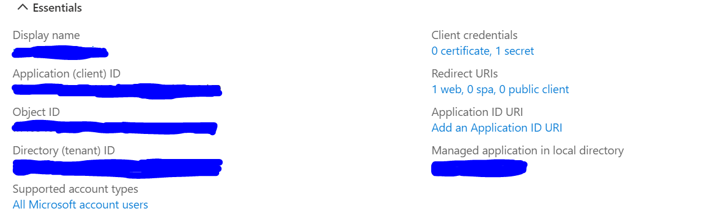
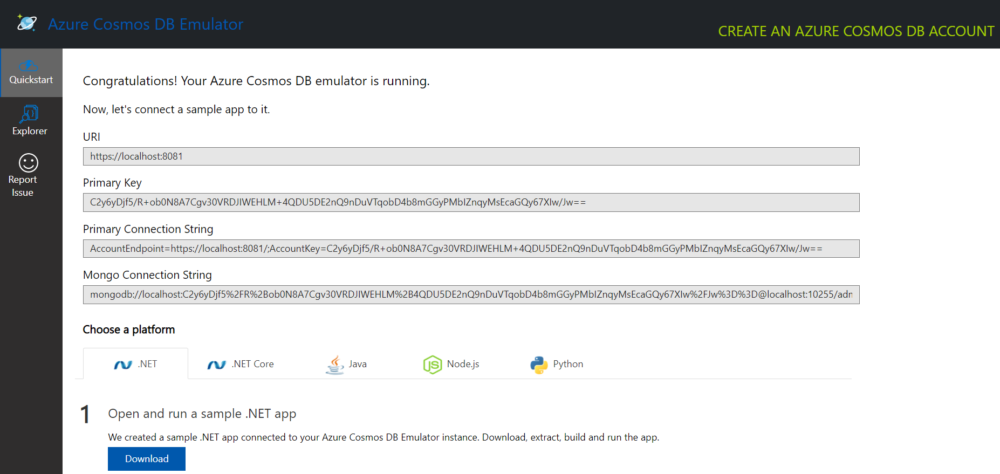

# Local setup guide 

## Prerequisites

To begin, you will need:

* [Azure CLI](https://docs.microsoft.com/cli/azure/install-azure-cli?view=azure-cli-latest?WT.mc_id=ltiAssessment-github-cxa)
* [.NET Core SDK](https://dotnet.microsoft.com/download?WT.mc_id=lti-github-cxa)
* [Node.js](https://nodejs.org/en/download/)
* [Git](https://git-scm.com/downloads)
* [Azure Subscription](https://azure.microsoft.com/free?WT.mc_id=ltiAssessment-github-cxa)
* [Visual Studio Code](https://code.visualstudio.com?WT.mc_id=ltiAssessment-github-cxa)
* [NuGet](https://www.nuget.org/downloads)
* [Azurite](https://docs.microsoft.com/azure/storage/common/storage-use-azurite?tabs=visual-studio)
* [Azure Cosmos DB Emulator](https://docs.microsoft.com/azure/cosmos-db/local-emulator?tabs=ssl-netstd21) 
* [Azure Functions Core Tools](
    https://docs.microsoft.com/en-us/azure/azure-functions/functions-run-local?tabs=v4%2Cwindows%2Ccsharp%2Cportal%2Cbash) 


## Create a Azure App registration
Create an App registration in your Azure Active directory (You should have admin or owner rights to your Azure active directory to be able to add applications and assign permissions to them). More detailed steps can be found https://docs.moodle.org/310/en/Microsoft_365#Enable_the_OpenID_Connect_Authentication_Plugin but they have been summarized below. 
* Sign in to your Microsoft Azure Management Portal.
* Within the Azure Services section, go to Azure Active Directory. Next, from the Manage section on the left, click on App Registrations.
* Click New registration on the top menu.
* Enter a name for your application (can be anything you want, but should let you know this is for your local assessment app).
* Choose an option applicable to your organisation in Supported account types section.
* Click Register
* Finally, add users to the application
* Click on the app registration, within the overview leaf, click under "Managed application in local directory"
            
* Click on "Assign users and groups"
* Add users that exist in the current active directory (If there are no users in the current Active Directory, create users in the Active directory first)
* Go to client/.env.development and fill out Tenant ID and Client ID from your app registration page. 

If you wish to connect your locally hosted assessment app to a locally hosted LMS (Like Moodle or Canvas ...), use the guides mentioned below.  
* [Devtest guide](../docs/DEVTEST.md) to help configure single-sign on to your Azure tenant using Azure active directory. 
* [Configuration guide](../docs/CONFIGURATION_GUIDE.md) to help configure the assessment app as an external web application on your LMS. 

## Set up and run Cosmos database instance 

* Start open the Azure Cosmos DB Emulator application. 
* By default, it should redirect you to https://localhost:8081/_explorer/index.html as shown below. 

* If this is the first time setting-up, continue following the remaining steps. 
* Click on the Explorer pane on the left and click create New Database and name it "assessment-app-db"
* Within this database, create containers with the following names - Question Banks, Questions , Student Responses, Platform Registration, Assessments.  

## Get the Azure functions set up locally
* You will only need to do the following steps once 
* Change the ../api/Assessment.App.Functions/temp.local.settings.json file to local.settings.json and save it.
* Fill in all the fields according to your own set up.   
    * "KeyVaultUrl" is from your key vault used by the assessment app deployed in production (non-local)
    * "EdnaLiteDevKey" and "EdnaKeyString" are the keys stored in the above-mentioned key vault 
    * "AzureAd:*" can be found in the app registration page of your local assessment application 
    * "ConnectionStrings" can be found in https://localhost:8081/_explorer/index.html after opening the Cosmos db emulator 
## Get the backend API running locally 

* Go to the root directory and enter "azurite" onto the terminal of your choice. 
* Open a new terminal window, go to ../api/Assessment.App.Functions directory and type "func start" to get the Azure Functions running locally. 


## Get client app running locally 
* Go to the client directory through your terminal of choice 
* Run ``` npm start ```
* Open another terminal in the same directory and run ``` npm run start-swa ```


