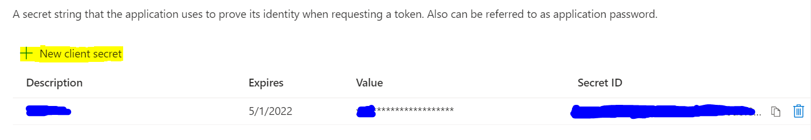

# Local setup guide 

## Prerequisites

To begin, you will need:

* [Azure CLI](https://docs.microsoft.com/cli/azure/install-azure-cli?view=azure-cli-latest?WT.mc_id=ltiAssessment-github-cxa)
* [.NET Core SDK](https://dotnet.microsoft.com/download?WT.mc_id=lti-github-cxa)
* [Node.js](https://nodejs.org/en/download/)
* [Git](https://git-scm.com/downloads)
* [Azure Subscription](https://azure.microsoft.com/free?WT.mc_id=ltiAssessment-github-cxa)
* [Visual Studio Code](https://code.visualstudio.com?WT.mc_id=ltiAssessment-github-cxa)
* [NuGet](https://www.nuget.org/downloads)
* Azurite 
* Azure Cosmos DB Emulator 
* Azure Functions Core Tools 
* Azure Static Web Apps CLI 


## Create a Azure active registration
Create an App registration in your Azure Active directory (You should have admin or owner rights to your Azure active directory to be able to add applications and assign permissions to them). Most detailed steps can be found https://docs.moodle.org/310/en/Microsoft_365#Enable_the_OpenID_Connect_Authentication_Plugin but they have been summarized below. 
        * Sign in to the Microsoft Azure Management Portal.
        * Click on the Azure Active Directory link from Azure services section, then App Registrations from Manage section on the left.
        * Click New registration on the top menu.
        * Enter a name for your application (can be anything you want, but should let you know this is for Moodle).
        * Choose option applicable to your organisation in Supported account types section.
        * In Redirect URI (optional) section, select Web and put the redirect URI from the OpenID Connect authentication plugin configuration. Ensure there is a trailing slash for this URI - i.e. https://example.com/auth/oidc/ CHANGE THISSSS
          
        * Click Register.
        * Within the application, locate the Application ID, note this value (write it down or copy it somewhere), and set it aside. You'll need it later.
        * Within the application, from the menu on the left, go to Certificates & secrets link in the Manage section.
            * Create a new client secret by clicking New client secret button.
            * Enter a description, and select a duration for "Expires".
            * Click Add.
            * A value will appear under Value, note this value (write it down or copy it somewhere) and set it aside. You'll need it later.
            
        * Within the application, click the API permissions link in the Manage section.
            * Click Add a permission button.
            * In Select an API section, choose Microsoft APIs tab, then choose Microsoft Graph.
            * Enable all permissions mentioned in the "Azure app permissions" section of https://docs.moodle.org/310/en/Microsoft_365#Enable_the_OpenID_Connect_Authentication_Plugin
        * Finally, add users to the application
            * Click on the app registration, within the overview leaf, click under "Managed application in local directory"
            
            * Click on "Assign users and groups"
            * Add users that exist in the current active directory (If there are no users in the current Active Directory, create users in the Active directory first)

## Get the backend API running locally 

* Go to the root directory and enter "azurite" onto the command prompt/bash/terminal 
* Open a new command prompt/bash/terminal and go to the api/Assessment.App.Functions directory and type "func start"

## Set up and run Cosmos database instance 

* Start open the Azure Cosmos DB Emulator application. 
* By default, it should redirect you to https://localhost:8081/_explorer/index.html as shown below. 

* Click on the Explorer pane on the left and click create New Database and name it "assessment-app-db"
* Within this database, create containers with the following names - Question Banks, Questions , Student Responses, Platform Registration, Assessments 


## Get client app running locally 
* Go to the client directory through your terminal of choice 
* Run ``` npm start ```
* Open another terminal in the same directory and run ``` npm run start-swa ```


