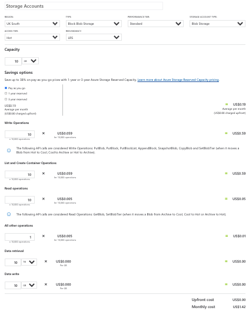

# Overview

The Azure LTI Assessment Application uses 4 services, links to the pricing for these services can be found here:

1. [Azure Functions](https://azure.microsoft.com/pricing/details/functions/)
2. [Azure KeyVault](https://azure.microsoft.com/pricing/details/key-vault/)
3. [Azure Storage](https://azure.microsoft.com/pricing/details/storage/blobs/)
4. [Azure Cosmos DB](https://azure.microsoft.com/pricing/details/cosmos-db/)

To calculate the estimated cost, you can use [Azure Pricing Calculator](https://azure.microsoft.com/pricing/calculator/).

In summary, the cost can vary and should be calculated on a case-by-case basis. However, we estimate the total cost of these services to be less than **$25 USD** per month per Institution installation.

## Azure Functions

## Azure KeyVault

## Azure Storage

## Azure Cosmos DB

