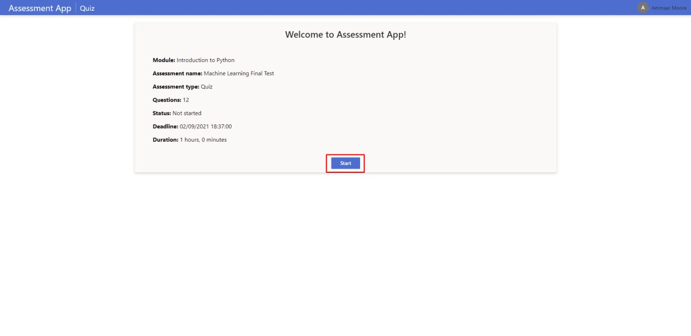

## Student Guide

### This guide is designed for students who use [Moodle LMS](https://moodle.org/).

To begin, you need to login to Moodle LMS and follow the steps:

1. Go to the course page.

2. Click on the assessment and you will be automatically redirected to the Assessment App.

3. On this page, you can see the assessment details, such as the number of questions, deadline, duration and others.
   Click **Start** when you are ready, and you will be redirected to the assessment.

4. You are on the Assessment page. The timer indicates how much time you have to complete the assessment.
   Please, complete the quiz and click **Submit** when you are ready.

5. Great job! On this page, you can see that the status of your assessment was changed to "completed".
   It means you are free to go, your response was captured and securely returned to Moodle.

